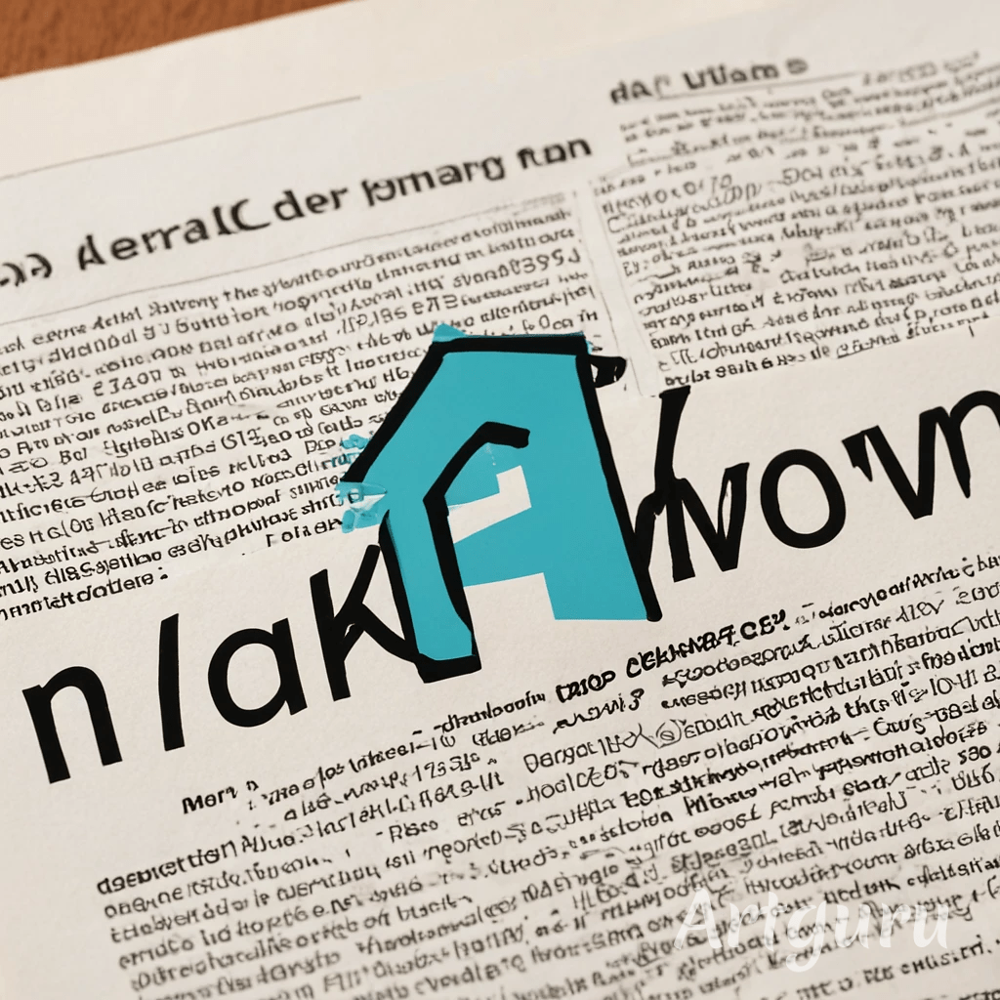
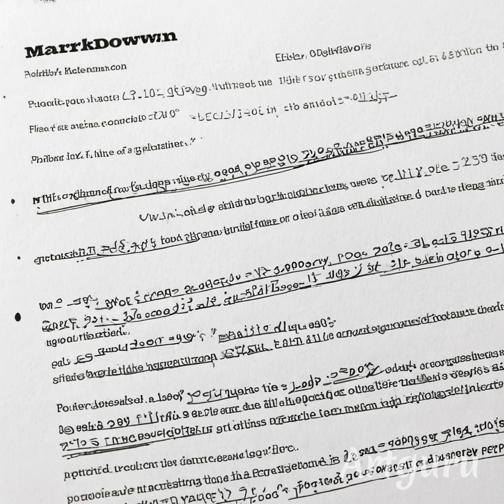

Markdown Rise - Проект, вспомошествующий разработке документации на программные продукты, и, возможно, не только.

# Примеры сайтов с документацией

- Нормас Mozilla - [Mozilla](https://developer.mozilla.org/en-US/docs/Web/API/Element/id)
- Убого Microsoft - [Microsoft Learn Challenge](https://learn.microsoft.com/en-us/cpp/intrinsics/debugbreak?view=msvc-170)

# Темы Jekyll для GitHub Pages, доступные искаропки

Темы, которые доступны по дефолту в GitHub Pages. Все они говно, но на базе можно попробовать что-то слепить.

Сейчас динки тема - `pages-themes/dinky@v0.2.0`

- [Architect](https://github.com/pages-themes/architect), [превью](https://pages-themes.github.io/architect/) - может пригодится, как база, 
  если решу использовать "Газету" или "Документ" как фон или как-то ещё (см. картинки ниже).

- [Cayman](https://github.com/pages-themes/cayman), [превью](https://pages-themes.github.io/cayman/) - унылая циано-зеленая тема, ничего интересного.

- [Dinky](https://github.com/pages-themes/dinky), [превью](https://pages-themes.github.io/dinky/) - в ней что-то есть, как любил приговаривать Тима.

- [Hacker](https://github.com/pages-themes/hacker), [превью](https://pages-themes.github.io/hacker/) - точно не для сайта продукта.

- [Leap day](https://github.com/pages-themes/leap-day), [превью](https://pages-themes.github.io/leap-day/) - осторожно, хохляцкий камуфляж - 
  из интересного - выводит слева подзаголовки статьи, надо спиздеть.

- [Merlot](https://github.com/pages-themes/merlot), [превью](https://pages-themes.github.io/merlot/) - унылое красное мерло.

- [Midnight](https://github.com/pages-themes/midnight), [превью](https://pages-themes.github.io/midnight/) - темная тема, типа хакерскрой, нафик.

- [Minima](https://github.com/jekyll/minima), [превью](https://jekyll.github.io/minima/) - минима интересна, для документации неплохо выглядит, 
  цвета надо на свои переделать, но общий стил неплох. Плюс тут типа как пример ленты новостей или блога - тоже надо приглядется на эту тему под блог-проекты.

- [Minimal](https://github.com/pages-themes/minimal), [превью](https://pages-themes.github.io/minimal/) - ничего особенного, но наверное что-то спиздеть можно, на карандаш.
  Что-то отдалённо похожее на гошку карношку.

- [Modernist](https://github.com/pages-themes/modernist), [превью](https://pages-themes.github.io/modernist/) - какое-то говно, напоминает PHP-BB форум.

- [Slate](https://github.com/pages-themes/slate), [превью](https://pages-themes.github.io/slate/) - ничего особенного, но наверное что-то спиздеть можно, на карандаш.
  Шапка плюс-минус годна. Серая тема, можно оранжевую на ней сделать

- [Tactile](https://github.com/pages-themes/tactile), [превью](https://pages-themes.github.io/tactile/) - говно.

- [Time machine](https://github.com/pages-themes/time-machine), [превью](https://pages-themes.github.io/time-machine/) - хз, вроде ничего, но ни о чем. Для продукта не тянет.

# Темы Jekyll

- [Бесплатные Jekyll темы](https://jekyllthemes.io/free)
- [Documentation Jekyll theme](https://jekyllthemes.io/theme/documentation), на [GitHub](https://github.com/tomjoht/documentation-theme-jekyll),
  [Live Demo](https://idratherbewriting.com/documentation-theme-jekyll/)

# Картинки

Нагенерил немного всякими иишками на пробу, для затравки для дальнейших мыслей.

**Газета**

**Документ**

**Markdown rise - Kandinsky 1**

**Markdown rise - Kandinsky 2**

Вот тут солнышко ничего такое, бодрое. Перекрасить в оранжевый, в диск солнца вставить иконку маркдауна - может получится лого для бренда.

**Markdown rise - Kandinsky - Markdown rise - Documentation - Programming - Realistic - No fantasy**

#// ****
#// 

# Полезные ссылки

- [Managing a custom domain for your GitHub Pages site](https://docs.github.com/en/pages/configuring-a-custom-domain-for-your-github-pages-site/managing-a-custom-domain-for-your-github-pages-site)
- [Setting a Markdown processor for your GitHub Pages site using Jekyll](https://docs.github.com/en/pages/setting-up-a-github-pages-site-with-jekyll/setting-a-markdown-processor-for-your-github-pages-site-using-jekyll)
- [Добавление темы на сайт GitHub Pages с помощью Jekyll](https://docs.github.com/ru/pages/setting-up-a-github-pages-site-with-jekyll/adding-a-theme-to-your-github-pages-site-using-jekyll).
  См. также раздел в конце - Customizing your theme's HTML layout
- [Configuring a publishing source for your GitHub Pages site](https://docs.github.com/en/pages/getting-started-with-github-pages/configuring-a-publishing-source-for-your-github-pages-site).
- [Supported themes](https://pages.github.com/themes/).
- [Creating a commit with multiple authors](https://docs.github.com/en/pull-requests/committing-changes-to-your-project/creating-and-editing-commits/creating-a-commit-with-multiple-authors)

 
## Link to other

Go to [other.md](other.md).
Go to [other](other).

# Header 1.2

- [Элементы интерфейса сайта](https://borodaboroda.com/blog/elementy-interfejsa-sajta/).
  Хлебные крошки — навигационная цепочка — элемент интерфейса, показывающий путь от начала до того уровня, где в данный момент находится пользователь.
- [Breadcrumb navigation](https://en.wikipedia.org/wiki/Breadcrumb_navigation).
- [Что такое UX/UI-дизайн](https://skillbox.ru/media/design/ux_ui_dizayn_chto_eto_takoe/)
- [Главные понятия для UX‑дизайнера. Часть 1](https://skillbox.ru/media/design/words-for-ux-1/)
- [словарь UX-дизайнера. Часть 2](https://skillbox.ru/media/design/words-for-ux-2/)
- [шрифт Аэропорт](https://skillbox.ru/media/design/studiya-revolver-type-pereosmyslila-legendarnyy-shrift-metyu-kartera-aeroport/)

There should be whitespace between paragraphs.

There should be whitespace between paragraphs. We recommend including a README, or a file with information about your project.

# Header 1.3

There should be whitespace between paragraphs.

There should be whitespace between paragraphs. We recommend including a README, or a file with information about your project.

# Header 1.4

There should be whitespace between paragraphs.

There should be whitespace between paragraphs. We recommend including a README, or a file with information about your project.

# Header 1.5

There should be whitespace between paragraphs.

There should be whitespace between paragraphs. We recommend including a README, or a file with information about your project.

# Header 1.6

There should be whitespace between paragraphs.

There should be whitespace between paragraphs. We recommend including a README, or a file with information about your project.

# Header 1.7

There should be whitespace between paragraphs.

There should be whitespace between paragraphs. We recommend including a README, or a file with information about your project.

# Header 1.8

There should be whitespace between paragraphs.

There should be whitespace between paragraphs. We recommend including a README, or a file with information about your project.

# Header 1.9

There should be whitespace between paragraphs.

There should be whitespace between paragraphs. We recommend including a README, or a file with information about your project.

# Header 1.3

There should be whitespace between paragraphs.

There should be whitespace between paragraphs. We recommend including a README, or a file with information about your project.

# Header 1.4

There should be whitespace between paragraphs.

There should be whitespace between paragraphs. We recommend including a README, or a file with information about your project.

# Header 1.5

There should be whitespace between paragraphs.

There should be whitespace between paragraphs. We recommend including a README, or a file with information about your project.

# Header 1.6

There should be whitespace between paragraphs.

There should be whitespace between paragraphs. We recommend including a README, or a file with information about your project.

# Header 1.7

There should be whitespace between paragraphs.

There should be whitespace between paragraphs. We recommend including a README, or a file with information about your project.

# Header 1.8

There should be whitespace between paragraphs.

There should be whitespace between paragraphs. We recommend including a README, or a file with information about your project.

# Header 1.9

There should be whitespace between paragraphs.

There should be whitespace between paragraphs. We recommend including a README, or a file with information about your project.

# Header 1.3

There should be whitespace between paragraphs.

There should be whitespace between paragraphs. We recommend including a README, or a file with information about your project.

# Header 1.4

There should be whitespace between paragraphs.

There should be whitespace between paragraphs. We recommend including a README, or a file with information about your project.

# Header 1.5

There should be whitespace between paragraphs.

There should be whitespace between paragraphs. We recommend including a README, or a file with information about your project.

# Header 1.6

There should be whitespace between paragraphs.

There should be whitespace between paragraphs. We recommend including a README, or a file with information about your project.

# Header 1.7

There should be whitespace between paragraphs.

There should be whitespace between paragraphs. We recommend including a README, or a file with information about your project.

# Header 1.8

There should be whitespace between paragraphs.

There should be whitespace between paragraphs. We recommend including a README, or a file with information about your project.

# Header 1.9

There should be whitespace between paragraphs.

There should be whitespace between paragraphs. We recommend including a README, or a file with information about your project.

# Header 1.3

There should be whitespace between paragraphs.

There should be whitespace between paragraphs. We recommend including a README, or a file with information about your project.

# Header 1.4

There should be whitespace between paragraphs.

There should be whitespace between paragraphs. We recommend including a README, or a file with information about your project.

# Header 1.5

There should be whitespace between paragraphs.

There should be whitespace between paragraphs. We recommend including a README, or a file with information about your project.

# Header 1.6

There should be whitespace between paragraphs.

There should be whitespace between paragraphs. We recommend including a README, or a file with information about your project.

# Header 1.7

There should be whitespace between paragraphs.

There should be whitespace between paragraphs. We recommend including a README, or a file with information about your project.

# Header 1.8

There should be whitespace between paragraphs.

There should be whitespace between paragraphs. We recommend including a README, or a file with information about your project.

# Header 1.9

There should be whitespace between paragraphs.

There should be whitespace between paragraphs. We recommend including a README, or a file with information about your project.

# Header 1.3

There should be whitespace between paragraphs.

There should be whitespace between paragraphs. We recommend including a README, or a file with information about your project.

# Header 1.4

There should be whitespace between paragraphs.

There should be whitespace between paragraphs. We recommend including a README, or a file with information about your project.

# Header 1.5

There should be whitespace between paragraphs.

There should be whitespace between paragraphs. We recommend including a README, or a file with information about your project.

# Header 1.6

There should be whitespace between paragraphs.

There should be whitespace between paragraphs. We recommend including a README, or a file with information about your project.

# Header 1.7

There should be whitespace between paragraphs.

There should be whitespace between paragraphs. We recommend including a README, or a file with information about your project.

# Header 1.8

There should be whitespace between paragraphs.

There should be whitespace between paragraphs. We recommend including a README, or a file with information about your project.

# Header 1.9

There should be whitespace between paragraphs.

There should be whitespace between paragraphs. We recommend including a README, or a file with information about your project.

